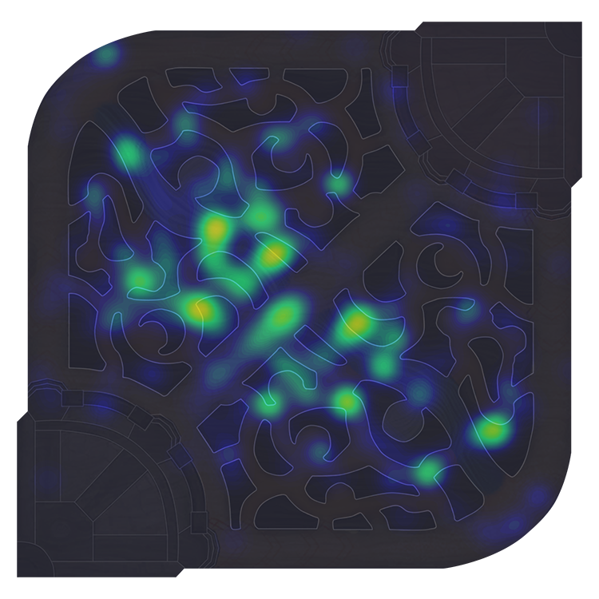

<h1 align="center">Gym LoL</h1>
<p align="center">
   
   <br>
   <a href="https://docs.python.org/3/whatsnew/3.7.html">
      
   </a>
   <a href="https://opensource.org/licenses/MIT">
      
   </a>
   <a href="https://app.fossa.io/projects/git%2Bgithub.com%2Fwau%2FAI-Aimbot?ref=badge_shield" alt="FOSSA Status">
   </a>
   <a href="https://gitter.im/StylishThemes/GitHub-Dark">
      
   </a>
   <a href="https://discord.gg/ZGsuhK">
      
   </a>
   <h3 align="center">A gym environment for League of Legends!</h3></p>

## This project is under construction!


## Installation

1. Install the dependencies for Windows.

> pip install keyboard
> pip install pytesseract

2. Install [OpenAI Gym](https://github.com/openai/gym) and its dependencies.
 ```
pip install gym
```

3. Download and install `gym-lol`:

 ```
git clone https://github.com/wau/gym-lol.git
cd gym-lol
python setup.py install
```

## Settings

It is recommended that you run the game at the lowest possible resolution (1280x768).